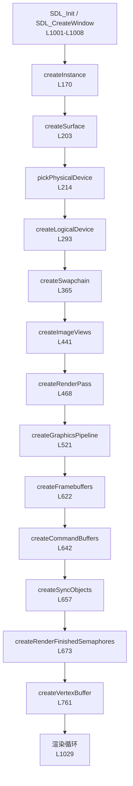
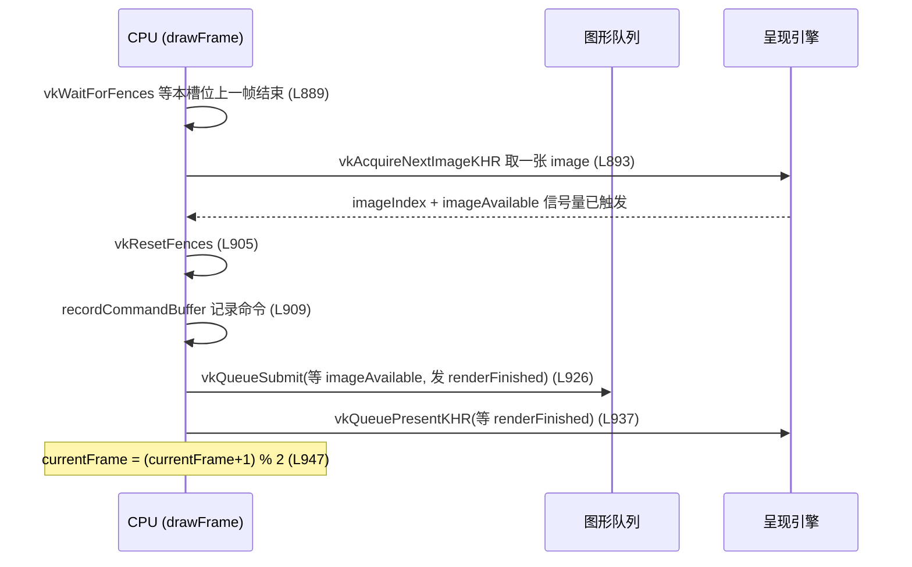

# `main.cpp` 逐行解析

> 配套文件：`main.cpp`（1063 行）、`shaders/triangle.vert`、`shaders/triangle.frag`、`CMakeLists.txt`
> 本文的行号与当前 `main.cpp` **一一对应**；空行、纯分隔注释行不单独占一行说明，会合并到相邻条目里。

---

## 目录

- [1. 程序总览](#1-程序总览)
- [2. 流程图](#2-流程图)
- [3. 逐行解释](#3-逐行解释)
  - [L1–L12 文件头注释](#l1l12-文件头注释)
  - [L14–L32 头文件与编译期宏](#l14l32-头文件与编译期宏)
  - [L34–L49 常量与 `VK_CHECK`](#l34l49-常量与-vk_check)
  - [L51–L89 顶点数据](#l51l89-顶点数据)
  - [L91–L119 小工具函数](#l91l119-小工具函数)
  - [L121–L164 `App` 结构体](#l121l164-app-结构体)
  - [L166–L208 Instance / Surface](#l166l208-instance--surface)
  - [L210–L326 物理设备 / 逻辑设备](#l210l326-物理设备--逻辑设备)
  - [L328–L462 Swapchain](#l328l462-swapchain)
  - [L464–L636 RenderPass / Pipeline](#l464l636-renderpass--pipeline)
  - [L638–L681 命令缓冲 / 同步对象](#l638l681-命令缓冲--同步对象)
  - [L683–L789 顶点缓冲](#l683l789-顶点缓冲)
  - [L791–L948 渲染](#l791l948-渲染)
  - [L950–L998 清理](#l950l998-清理)
  - [L1000–L1063 主流程](#l1000l1063-主流程)
- [4. 附录：术语与踩坑记录](#4-附录术语与踩坑记录)

---

## 1. 程序总览

这个程序做的事情：打开一个 1280×720 的可缩放窗口，用 Vulkan 画一个**红绿蓝渐变三角形**，按 ESC 或关闭窗口退出。

整个程序可以拆成三段：

| 阶段 | 涉及的行 | 做什么 |
|---|---|---|
| **初始化** | L170–L789 | 建窗口 → 建设备 → 建交换链 → 建管线 → 建顶点缓冲 |
| **渲染循环** | L887–L948 | 每帧：等帧结束 → 取一张交换链图像 → 记录命令 → 提交 → 呈现 |
| **清理** | L954–L998 | 逆序销毁所有 Vulkan 对象 |

几个贯穿全文的关键设计：

| 设计 | 说明 |
|---|---|
| **`App` 结构体** | 所有 Vulkan 对象集中放一个结构体，函数统一签名 `fn(App &app)`，避免几十个参数；清理时也不用到处传句柄 |
| **`VK_CHECK` 宏** | L42，任何返回 `VkResult` 的调用失败就抛异常，`main` 里统一捕获→清理→退出，不用写满屏 `if` |
| **2 帧在飞（double buffering）** | L39，GPU 还在画第 N 帧时 CPU 已经在准备第 N+1 帧 |
| **动态 viewport/scissor** | L560 / L588，窗口大小变了不用重建管线，只在命令缓冲里重设 |
| **`recreateSwapchain`** | L863，窗口缩放/最小化时整条交换链相关的对象重建 |

---

## 2. 流程图

### 2.1 初始化顺序

> ⚠️ `createVertexBuffer` 内部要用 `commandPool` 做拷贝，所以必须排在 `createCommandBuffers` 之后。

### 2.2 每帧的同步流程

---

## 3. 逐行解释

### L1–L12 文件头注释

| 行 | 代码 | 说明 |
|---|---|---|
| 1 | `// Vulkan + SDL2 绘制一个三角形的完整最小样例` | 一句话说明程序用途 |
| 3–6 | `// 初始化顺序: ...` | 列出 Vulkan 对象的创建顺序，就是上面流程图那一条链 |
| 8–9 | `// 顶点数据 ... 上传到设备本地的顶点缓冲` | 说明顶点数据来源：CPU 端 `kVertices` → 暂存缓冲 → 设备本地缓冲 |
| 11–12 | `// 编译: cmake -B build && cmake --build build` | 编译/运行命令备忘，后面 `readFile` 报错提示里也会引用它 |

### L14–L32 头文件与编译期宏

| 行 | 代码 | 说明 |
|---|---|---|
| 14 | `#include <SDL2/SDL.h>` | SDL 主头文件：窗口、事件循环 |
| 15 | `#include <SDL2/SDL_vulkan.h>` | SDL 的 Vulkan 辅助头：查询扩展名、创建 `VkSurfaceKHR` |
| 16 | `#include <vulkan/vulkan.h>` | Vulkan C API 头文件（不加 `VULKAN_HPP_NO_EXCEPTIONS` 之类的宏，用的是纯 C 接口） |
| 18 | `#include <algorithm>` | 用到 `std::clamp`（L393/L395） |
| 19 | `#include <array>` | 用到 `std::array`（顶点数组、命令缓冲数组等） |
| 20 | `#include <cstddef>` | 用到 `offsetof`（L75/L80） |
| 21 | `#include <cstdint>` | `uint32_t` / `UINT32_MAX` / `UINT64_MAX` |
| 22 | `#include <cstring>` | 用到 `std::memcpy`（L774） |
| 23 | `#include <fstream>` | `readFile` 里读 `.spv` 二进制文件 |
| 24 | `#include <iostream>` | `std::cout` / `std::cerr` 打印信息 |
| 25 | `#include <stdexcept>` | `std::runtime_error`，`VK_CHECK` 和自定义错误都用它 |
| 26 | `#include <string>` | `std::string` 拼错误信息、拼着色器路径 |
| 27 | `#include <vector>` | 各种动态数组（扩展名列表、交换链图像列表……） |
| 29 | `// 由 CMake 传入，指向编译好的 .spv 所在目录` | 注释：`SHADER_DIR` 的来源 |
| 30–31 | `#ifndef SHADER_DIR` / `#define SHADER_DIR "shaders"` | 兜底值：如果不用 CMake 编译（没定义宏）就按相对路径 `shaders/` 找 |
| 32 | `#endif` | 条件编译结束 |

> CMake 那边通过 `target_compile_definitions(... SHADER_DIR="${CMAKE_BINARY_DIR}/shaders")` 传进来，所以实际运行时读的是 `build/shaders/triangle.vert.spv`。

### L34–L49 常量与 `VK_CHECK`

| 行 | 代码 | 说明 |
|---|---|---|
| 34 | `namespace {` | **匿名命名空间**：里面所有函数/变量都是内部链接，只在本文档内可见，相当于 `static` |
| 36 | `constexpr int kWidth = 1280;` | 窗口初始宽 |
| 37 | `constexpr int kHeight = 720;` | 窗口初始高 |
| 39 | `constexpr uint32_t kMaxFramesInFlight = 2;` | 同时"在飞"的帧数。2 = 双缓冲：CPU 准备下一帧的同时 GPU 在画当前帧 |
| 41 | `// 出错就抛异常，避免到处写 if (result != VK_SUCCESS)` | 宏的设计意图 |
| 42 | `#define VK_CHECK(expr) \` | 宏入口，`expr` 是任意返回 `VkResult` 的 Vulkan 调用 |
| 43 | `do { \` | 用 `do{...}while(false)` 包裹，保证宏在 `if/else` 里当单条语句使用时不会被拆散 |
| 44 | `VkResult vkResult_ = (expr); \` | **只求值一次**，变量名带下划线避免和外层同名 |
| 45 | `if (vkResult_ != VK_SUCCESS) { \` | 失败就…… |
| 46–47 | `throw std::runtime_error(std::string(#expr) + " 失败, VkResult = " + std::to_string(...)); \` | 抛出异常，`#expr` 把调用表达式原样变成字符串，报错时能直接看到是哪一句挂了，`static_cast<int>` 是为了让 `VkResult` 能转成字符串 |
| 48–49 | `} \` / `} while (false)` | 收尾；分号由调用方写，所以宏体里不写分号 |

### L51–L89 顶点数据

| 行 | 代码 | 说明 |
|---|---|---|
| 52 | `// 顶点数据: 由 CPU 端提供，再通过顶点缓冲上传给 GPU` | 本节主题：顶点数据在 CPU 端定义，**不再写死在着色器里** |
| 55 | `struct Vertex {` | 一个顶点的内存布局。字段顺序 = 显存里字节顺序 |
| 56 | `float pos[2];` | 位置：二维，8 字节 |
| 57 | `float color[3];` | 颜色：RGB 三通道，12 字节。整个 `Vertex` = 20 字节 |
| 59–60 | `// 顶点缓冲的绑定描述...` / `static VkVertexInputBindingDescription bindingDescription() {` | 静态函数：描述"顶点缓冲怎么读"。用函数而不是全局变量，是为了让描述和结构体定义靠在一起 |
| 61 | `VkVertexInputBindingDescription binding{};` | `{}` 全部清零，避免未初始化字段被校验层报错 |
| 62 | `binding.binding = 0;` | 绑定编号 0；`vkCmdBindVertexBuffers` 时也用 0，两边要对应 |
| 63 | `binding.stride = sizeof(Vertex);` | **步长**：每隔 20 字节就是一个新顶点 |
| 64 | `binding.inputRate = VK_VERTEX_INPUT_RATE_VERTEX;` | 每个顶点前进一次（另一个可选值是每个实例前进一次） |
| 65 | `return binding;` | 返回给管线创建用 |
| 68–69 | `// 属性描述...` / `static std::array<VkVertexInputAttributeDescription, 2> attributeDescriptions() {` | 描述"结构体里的哪几个 float 喂给着色器的哪个 location" |
| 70 | `std::array<VkVertexInputAttributeDescription, 2> attributes{};` | 两个属性：位置、颜色 |
| 72 | `attributes[0].binding = 0;` | 位置属性来自 0 号绑定 |
| 73 | `attributes[0].location = 0;` | 对应着色器里的 `layout(location = 0) in vec2 inPosition` |
| 74 | `attributes[0].format = VK_FORMAT_R32G32_SFLOAT;` | 数据格式：两个 32 位浮点 = `vec2` |
| 75 | `attributes[0].offset = offsetof(Vertex, pos);` | 在结构体里的字节偏移（这里是 0）。用 `offsetof` 而不是写死 0，改字段顺序也不会错 |
| 77 | `attributes[1].binding = 0;` | 颜色属性也来自 0 号绑定（同一个缓冲） |
| 78 | `attributes[1].location = 1;` | 对应 `layout(location = 1) in vec3 inColor` |
| 79 | `attributes[1].format = VK_FORMAT_R32G32B32_SFLOAT;` | 三个 32 位浮点 = `vec3` |
| 80 | `attributes[1].offset = offsetof(Vertex, color);` | 颜色在结构体里的偏移（这里是 8 字节） |
| 81–83 | `return attributes;` / `}` / `};` | 返回两个属性的数组，结构体定义结束 |
| 85 | `const std::array<Vertex, 3> kVertices = {{` | 真正的顶点数据，3 个顶点；外面的花括号是 `std::array` 的，里面的是内层数组初始化的 |
| 86 | `{{0.0f, -0.5f}, {1.0f, 0.0f, 0.0f}},  // 上, 红` | 顶点 0：NDC 坐标 (0, −0.5)，红色。注意 Vulkan 的 NDC 里 **y 轴向下**，所以 −0.5 在屏幕上方 |
| 87 | `{{0.5f, 0.5f}, {0.0f, 1.0f, 0.0f}},   // 右下, 绿` | 顶点 1：右下角，绿色 |
| 88 | `{{-0.5f, 0.5f}, {0.0f, 0.0f, 1.0f}},  // 左下, 蓝` | 顶点 2：左下角，蓝色 |
| 89 | `}};` | 数组结束 |

### L91–L119 小工具函数

| 行 | 代码 | 说明 |
|---|---|---|
| 95 | `std::vector<char> readFile(const std::string &path) {` | 读整个文件到内存，返回字节数组。用于加载 `.spv` |
| 96 | `std::ifstream file(path, std::ios::ate \| std::ios::binary);` | `ate` = 打开后光标立刻定位到**末尾**（这样 `tellg()` 就能得到文件大小）；`binary` 必须加，因为 SPIR-V 是二进制，不能做换行转换 |
| 97 | `if (!file.is_open()) {` | 打开失败处理 |
| 98–99 | `throw std::runtime_error("无法打开文件: " + path + " (是否已用 cmake --build build 编译着色器?)");` | 报错信息里直接给出最可能的原因：忘了编译着色器 |
| 101 | `const size_t size = static_cast<size_t>(file.tellg());` | 当前光标位置 = 文件大小（因为 `ate`） |
| 102 | `std::vector<char> buffer(size);` | 一次性分配好，不用边读边扩容 |
| 103 | `file.seekg(0);` | 光标挪回开头准备读 |
| 104 | `file.read(buffer.data(), static_cast<std::streamsize>(size));` | 一次读完 |
| 105–106 | `return buffer;` / `}` | 返回内容（编译器会做 RVO/移动，不会真的拷贝） |
| 108 | `bool hasValidationLayer() {` | 查询实例层里有没有 Khronos 校验层 |
| 109–110 | `uint32_t count = 0;` / `vkEnumerateInstanceLayerProperties(&count, nullptr);` | Vulkan 经典的"调用两次"套路：第一次 `pProperties = nullptr` 只拿数量 |
| 111 | `std::vector<VkLayerProperties> layers(count);` | 按数量分配数组 |
| 112 | `vkEnumerateInstanceLayerProperties(&count, layers.data());` | 第二次真正填数据 |
| 113 | `for (const auto &layer : layers) {` | 遍历所有层 |
| 114 | `if (std::string(layer.layerName) == "VK_LAYER_KHRONOS_validation") {` | 名字匹配 KHronos 官方校验层 |
| 115–117 | `return true;` / `}` / `}` | 找到就返回 |
| 118–119 | `return false;` / `}` | 没找到返回 false。**这样写比硬编码启用更健壮** —— 层不存在时启用会让 `vkCreateInstance` 直接失败 |

### L121–L164 `App` 结构体

| 行 | 代码 | 说明 |
|---|---|---|
| 122 | `// 所有 Vulkan 对象都放在这里，方便传参和统一清理` | 设计意图：全局状态集中管理 |
| 125 | `struct App {` | 成员默认值都写成 `VK_NULL_HANDLE` / `nullptr`，这样清理时判断句柄是否有效 |
| 126 | `SDL_Window *window = nullptr;` | SDL 窗口，不是 Vulkan 对象但和 surface 绑定 |
| 127 | `bool quitRequested = false;` | 事件循环退出标志（关窗/ESC） |
| 129 | `VkInstance instance = VK_NULL_HANDLE;` | Vulkan 实例：程序与 Vulkan 运行时的连接 |
| 130 | `VkSurfaceKHR surface = VK_NULL_HANDLE;` | 绘制目标抽象：一块"可呈现的窗口表面" |
| 131 | `VkPhysicalDevice physicalDevice = VK_NULL_HANDLE;` | 物理设备：选中的那张显卡 |
| 132 | `VkDevice device = VK_NULL_HANDLE;` | 逻辑设备：我们和显卡交互的主要句柄 |
| 133–134 | `VkQueue graphicsQueue / presentQueue` | 两条队列：一条画图，一条呈现。可能来自同一个队列族 |
| 135–136 | `uint32_t graphicsFamily / presentFamily = UINT32_MAX` | 队列族索引，`UINT32_MAX` 表示"还没找到" |
| 138 | `VkSwapchainKHR swapchain = VK_NULL_HANDLE;` | 交换链：一组（这里是 3 张）用于呈现的图像 |
| 139 | `VkFormat swapchainFormat = VK_FORMAT_UNDEFINED;` | 交换链图像格式（本机是 `B8G8R8A8_SRGB`） |
| 140 | `VkExtent2D swapchainExtent{};` | 交换链尺寸，用于设 viewport/scissor |
| 141 | `std::vector<VkImage> swapchainImages;` | 交换链内部的图像，由 `vkGetSwapchainImagesKHR` 取出，**不需要也不能自己销毁** |
| 142 | `std::vector<VkImageView> swapchainImageViews;` | 每张图像的视图，管线要通过 view 访问图像。这个要自己销毁 |
| 143 | `std::vector<VkFramebuffer> framebuffers;` | 每个 image view 配一个 framebuffer，作为渲染目标的载体 |
| 145 | `VkRenderPass renderPass = VK_NULL_HANDLE;` | 渲染通道：描述附件的加载/存储和布局转换 |
| 146 | `VkPipelineLayout pipelineLayout = VK_NULL_HANDLE;` | 管线布局：描述资源绑定（本样例没有 uniform，所以是空的） |
| 147 | `VkPipeline pipeline = VK_NULL_HANDLE;` | 图形管线：把着色器 + 各种固定功能状态打包好的"渲染配方" |
| 149 | `// 顶点缓冲，存在设备本地内存里` | 注释 |
| 150 | `VkBuffer vertexBuffer = VK_NULL_HANDLE;` | 顶点缓冲句柄 |
| 151 | `VkDeviceMemory vertexBufferMemory = VK_NULL_HANDLE;` | 缓冲背后的显存分配。**Buffer 和 Memory 是分开的两个对象**，用 `vkBindBufferMemory` 绑定 |
| 152 | `uint32_t vertexCount = static_cast<uint32_t>(kVertices.size());` | 顶点数，`vkCmdDraw` 要用 |
| 154 | `VkCommandPool commandPool = VK_NULL_HANDLE;` | 命令池：分配命令缓冲的地方，也决定这些命令能提交给哪个队列族 |
| 155 | `std::array<VkCommandBuffer, kMaxFramesInFlight> commandBuffers{};` | **每帧一个**命令缓冲，避免 CPU 重录时踩到 GPU 还在执行的命令 |
| 156 | `std::array<VkSemaphore, kMaxFramesInFlight> imageAvailable{};` | 图像可用信号量：`vkAcquireNextImageKHR` 触发它，提交时等它 |
| 157 | `std::array<VkFence, kMaxFramesInFlight> inFlightFences{};` | 栅栏：CPU 用它知道"这一帧的 GPU 工作完成了"，可以安全重录/复用该槽位 |
| 158–160 | `// 注意: 这个信号量按 swapchain image 索引...` | **踩坑记录**：为什么下面这个不是 `std::array` 而是 `std::vector` |
| 161 | `std::vector<VkSemaphore> renderFinished;` | 渲染完成信号量：**每个 swapchain image 一个**，用 `imageIndex` 索引。若按帧槽位复用，校验层会报 `VUID-vkQueueSubmit-pSignalSemaphores-00067`（呈现操作绑定在 image 上，信号量可能还在用） |
| 162 | `uint32_t currentFrame = 0;` | 当前帧槽位，取值 0/1 循环 |
| 163 | `bool framebufferResized = false;` | 窗口尺寸变化标记，由 SDL 事件设置，在呈现后统一重建交换链 |
| 164 | `};` | 结构体结束 |

### L166–L208 Instance / Surface

| 行 | 代码 | 说明 |
|---|---|---|
| 170 | `void createInstance(App &app) {` | 创建 Vulkan 实例 |
| 171 | `// SDL 会告诉我们当前视频后端 (X11/Wayland) 需要哪些 instance 扩展` | 关键点：扩展名依赖平台，**不能写死** |
| 172–173 | `uint32_t extensionCount = 0;` / `SDL_Vulkan_GetInstanceExtensions(app.window, &extensionCount, nullptr);` | 又是"调两次拿数量"的套路 |
| 174 | `std::vector<const char *> extensions(extensionCount);` | 注意是 `const char *` 数组，SDL 返回的是字符串指针 |
| 175 | `SDL_Vulkan_GetInstanceExtensions(app.window, &extensionCount, extensions.data());` | 第二次调用真正拿到 `VK_KHR_surface` + `VK_KHR_xcb_surface`（或 wayland）等名字 |
| 177 | `std::vector<const char *> layers;` | 要启用的层列表，默认为空 |
| 178 | `if (hasValidationLayer()) {` | 动态检测（见 L108） |
| 179 | `layers.push_back("VK_LAYER_KHRONOS_validation");` | 存在才启用 |
| 180–182 | `} else { std::cout << "[提示] 未安装 ..."; }` | 不存在就提示一句，程序照常跑 |
| 184 | `VkApplicationInfo appInfo{};` | 应用信息结构体，`{}` 清零 |
| 185 | `appInfo.sType = VK_STRUCTURE_TYPE_APPLICATION_INFO;` | **Vulkan 的 `sType` 相当于结构体的类型标签**，每个结构体都必须填，否则校验层直接报错（也是最常见的崩溃原因之一） |
| 186 | `appInfo.pApplicationName = "vulkan-triangle";` | 应用名，驱动/调试工具里会显示 |
| 187 | `appInfo.applicationVersion = VK_MAKE_VERSION(1, 0, 0);` | 应用版本，`VK_MAKE_VERSION` 把 major/minor/patch 打包成一个整数 |
| 188 | `appInfo.pEngineName = "none";` | 引擎名，这里没有引擎 |
| 189 | `appInfo.engineVersion = VK_MAKE_VERSION(1, 0, 0);` | 引擎版本 |
| 190 | `appInfo.apiVersion = VK_API_VERSION_1_1;` | **要用的 Vulkan API 版本**。程序没用任何 1.2+ 特性，写 1.1 兼容性最好（本机支持到 1.4） |
| 192 | `VkInstanceCreateInfo createInfo{};` | 实例创建参数 |
| 193 | `createInfo.sType = VK_STRUCTURE_TYPE_INSTANCE_CREATE_INFO;` | 类型标签 |
| 194 | `createInfo.pApplicationInfo = &appInfo;` | 关联上面的 `appInfo` |
| 195 | `createInfo.enabledExtensionCount = static_cast<uint32_t>(extensions.size());` | 扩展数量（`size_t` → `uint32_t` 显式转换） |
| 196 | `createInfo.ppEnabledExtensionNames = extensions.data();` | 扩展名字数组。注意类型是 `const char * const *`，所以字段名是 **pp** 开头 |
| 197 | `createInfo.enabledLayerCount = static_cast<uint32_t>(layers.size());` | 层数量 |
| 198 | `createInfo.ppEnabledLayerNames = layers.empty() ? nullptr : layers.data();` | 数量为 0 时传 `nullptr`，避免某些驱动对"非空指针 + 数量 0"报错 |
| 200 | `VK_CHECK(vkCreateInstance(&createInfo, nullptr, &app.instance));` | 真正创建。第二个参数是分配器回调，`nullptr` = 用默认分配器 |
| 201 | `}` | 函数结束 |
| 203 | `void createSurface(App &app) {` | 创建绘制表面 |
| 204 | `if (!SDL_Vulkan_CreateSurface(app.window, app.instance, &app.surface)) {` | SDL 封装了平台差异（X11/Wayland）并返回 `SDL_bool`，失败返回 false |
| 205–206 | `throw std::runtime_error(std::string("创建 Vulkan Surface 失败: ") + SDL_GetError());` | 用 `SDL_GetError()` 给出具体原因 |
| 207–208 | `}` / `}` | 收尾 |

### L210–L326 物理设备 / 逻辑设备

| 行 | 代码 | 说明 |
|---|---|---|
| 214 | `void pickPhysicalDevice(App &app) {` | 从系统里所有支持 Vulkan 的显卡中挑一张 |
| 215–216 | `uint32_t deviceCount = 0;` / `vkEnumeratePhysicalDevices(app.instance, &deviceCount, nullptr);` | 老套路：先拿数量。物理设备可以是独显、核显，甚至软件模拟器 |
| 217–219 | `if (deviceCount == 0) { throw ... }` | 一张都没有 → 直接报错退出 |
| 220–221 | `std::vector<VkPhysicalDevice> devices(deviceCount);` / `vkEnumeratePhysicalDevices(..., devices.data());` | 第二次拿到句柄列表 |
| 223 | `int bestScore = -1;` | 打分制选设备，分数最高的胜出 |
| 224 | `for (VkPhysicalDevice device : devices) {` | 逐个评估 |
| 226–229 | `uint32_t familyCount = 0;` / `vkGetPhysicalDeviceQueueFamilyProperties(...)` ×2 | 拿到这张卡所有队列族的信息（同样"调两次"） |
| 231–232 | `uint32_t graphics = UINT32_MAX;` / `uint32_t present = UINT32_MAX;` | 分别记录"支持图形"和"支持呈现到本窗口"的队列族索引 |
| 233 | `for (uint32_t i = 0; i < familyCount; ++i) {` | 遍历每个队列族 |
| 234–236 | `if ((families[i].queueFlags & VK_QUEUE_GRAPHICS_BIT) && graphics == UINT32_MAX) { graphics = i; }` | 第一个带 `GRAPHICS` 位的族用来画图。`&` 是位标志测试 |
| 238 | `VkBool32 presentSupport = VK_FALSE;` | 输出参数，`VkBool32` 就是 32 位的 bool |
| 239 | `vkGetPhysicalDeviceSurfaceSupportKHR(device, i, app.surface, &presentSupport);` | **呈现支持必须逐队列族单独查询**，这是唯一不能在创建实例时就知道的信息 |
| 240–242 | `if (presentSupport && present == UINT32_MAX) { present = i; }` | 记录第一个能呈现的族 |
| 244–246 | `if (graphics == UINT32_MAX \|\| present == UINT32_MAX) { continue; }` | 二者缺一 → 这张卡不能用，跳过 |
| 249–252 | `uint32_t extCount = 0;` / `vkEnumerateDeviceExtensionProperties(...)` ×2 | 拿到这张卡支持的**设备扩展**（和实例扩展是两个层级） |
| 253 | `bool hasSwapchain = false;` | 是否支持 `VK_KHR_swapchain` |
| 254–257 | `for (const auto &ext : exts) { if (std::string(ext.extensionName) == VK_KHR_SWAPCHAIN_EXTENSION_NAME) { hasSwapchain = true; } }` | 名字匹配。`VK_KHR_SWAPCHAIN_EXTENSION_NAME` 是宏，值为 `"VK_KHR_swapchain"` |
| 259–261 | `if (!hasSwapchain) { continue; }` | 不支持交换链的卡直接跳过 |
| 264–267 | `uint32_t formatCount = 0;` / `uint32_t modeCount = 0;` / 两个查询 | 查询 surface 支持的格式数和呈现模式数。**只查数量不查内容**，因为这里只想判断"有没有" |
| 268–270 | `if (formatCount == 0 \|\| modeCount == 0) { continue; }` | 一个都没有说明这个 surface 不可用（有些卡在该窗口协议下就是这样） |
| 272–273 | `VkPhysicalDeviceProperties props{};` / `vkGetPhysicalDeviceProperties(device, &props);` | 拿设备属性（名字、类型、各种限制值） |
| 276 | `int score = (props.deviceType == VK_PHYSICAL_DEVICE_TYPE_DISCRETE_GPU) ? 1000 : 100;` | **独立显卡优先**（1000 分），其他（核显/虚拟/CPU）100 分 |
| 277 | `score += static_cast<int>(props.limits.maxImageDimension2D / 1024);` | 再用"最大 2D 图像尺寸"做次要区分（本机 16384 → +16） |
| 279–285 | `if (score > bestScore) { ... }` | 分数更高就替换：记录设备句柄、两个队列族索引，并打印显卡名 |
| 288–290 | `if (app.physicalDevice == VK_NULL_HANDLE) { throw ... }` | 遍历完一个都没选上 → 报错 |
| 293 | `void createLogicalDevice(App &app) {` | 创建逻辑设备（我们实际使用的那个 `VkDevice`） |
| 295 | `std::vector<uint32_t> uniqueFamilies = {app.graphicsFamily};` | 先把图形族放进去 |
| 296–298 | `if (app.presentFamily != app.graphicsFamily) { uniqueFamilies.push_back(app.presentFamily); }` | 两者不同才加第二个。**同一个族只创建一次队列**，否则驱动会报错 |
| 300 | `const float priority = 1.0f;` | 队列优先级，取值 0.0–1.0。`const` 是为了取地址时生命周期足够长 |
| 301 | `std::vector<VkDeviceQueueCreateInfo> queueInfos;` | 每个族一个创建信息 |
| 302–309 | `for (uint32_t family : uniqueFamilies) { ... }` | 循环里填 `queueFamilyIndex` / `queueCount = 1` / `pQueuePriorities = &priority`，然后 push 进 vector |
| 303 | `VkDeviceQueueCreateInfo queueInfo{};` | 注意：**在循环内声明**，每次都是全新清零的结构体，不会被上一轮残留污染 |
| 311 | `const char *deviceExtensions[] = {VK_KHR_SWAPCHAIN_EXTENSION_NAME};` | 设备扩展只有交换链 |
| 312 | `VkPhysicalDeviceFeatures features{};` | 全部特性关闭（全 0）。本样例不需要任何可选特性 |
| 314 | `VkDeviceCreateInfo createInfo{};` | 逻辑设备创建信息 |
| 316–317 | `createInfo.queueCreateInfoCount = ...;` / `createInfo.pQueueCreateInfos = queueInfos.data();` | 关联上面收集的队列创建信息 |
| 318 | `createInfo.pEnabledFeatures = &features;` | 关联特性结构体 |
| 319–320 | `createInfo.enabledExtensionCount = 1;` / `createInfo.ppEnabledExtensionNames = deviceExtensions;` | 只启用交换链扩展 |
| 322 | `VK_CHECK(vkCreateDevice(app.physicalDevice, &createInfo, nullptr, &app.device));` | 创建逻辑设备 |
| 324 | `vkGetDeviceQueue(app.device, app.graphicsFamily, 0, &app.graphicsQueue);` | **队列句柄不能自己创建**，只能从设备里取；最后一个参数是队列索引（我们每个族只要 1 条，所以是 0） |
| 325 | `vkGetDeviceQueue(app.device, app.presentFamily, 0, &app.presentQueue);` | 取呈现队列 |

### L328–L462 Swapchain

| 行 | 代码 | 说明 |
|---|---|---|
| 332 | `VkSurfaceFormatKHR chooseSurfaceFormat(const std::vector<VkSurfaceFormatKHR> &formats) {` | 从支持的格式里挑一个 |
| 334 | `for (const auto &format : formats) {` | 遍历 |
| 335–336 | `if (format.format == VK_FORMAT_B8G8R8A8_SRGB && format.colorSpace == VK_COLOR_SPACE_SRGB_NONLINEAR_KHR) {` | 优先 `B8G8R8A8_SRGB` + sRGB 非线性色彩空间：着色器输出线性值，硬件自动做 gamma 编码，颜色才正确 |
| 337–338 | `return format;` / `}` | 找到就返回 |
| 340 | `return formats[0];` | 没找到就用第一个，**保证总能返回一个合法值**（这是唯一保证存在的格式） |
| 343 | `VkPresentModeKHR choosePresentMode(const std::vector<VkPresentModeKHR> &modes) {` | 挑呈现模式 |
| 345 | `for (VkPresentModeKHR mode : modes) {` | 遍历 |
| 346–347 | `if (mode == VK_PRESENT_MODE_MAILBOX_KHR) { return mode; }` | `MAILBOX`（三缓冲式）延迟更低，优先用 |
| 350 | `return VK_PRESENT_MODE_FIFO_KHR;` | `FIFO` 是规范**强制必须支持**的模式，等于垂直同步，作为兜底 |
| 353 | `VkCompositeAlphaFlagBitsKHR chooseCompositeAlpha(VkCompositeAlphaFlagsKHR supported) {` | 挑合成方式（窗口如何与桌面其它内容合成） |
| 354–356 | `const VkCompositeAlphaFlagBitsKHR candidates[] = { OPAQUE, PRE_MULTIPLIED, POST_MULTIPLIED, INHERIT };` | 按"最想要 → 最不想要"排序 |
| 357–358 | `for (...) { if (supported & flag) {` | 位与测试：驱动报告的支持位里有没有这一位 |
| 359–362 | `return flag;` / `...` / `return VK_COMPOSITE_ALPHA_OPAQUE_BIT_KHR;` | 返回第一个支持的；理论上不会走到最后的兜底返回 |
| 365 | `void createSwapchain(App &app) {` | 创建交换链，**这是全文最长的函数** |
| 366–368 | `VkSurfaceCapabilitiesKHR caps{};` / `VK_CHECK(vkGetPhysicalDeviceSurfaceCapabilitiesKHR(...));` | 查 surface 能力：最小/最大图像数、最小/最大尺寸、当前尺寸、支持的变换和合成方式 |
| 370–375 | 查询 surface 支持的**格式列表**（调两次） | 这次需要真正的内容，所以做了 `resize` + 第二次填充 |
| 377–382 | 查询 surface 支持的**呈现模式列表**（调两次） | 同上 |
| 384–385 | `const VkSurfaceFormatKHR surfaceFormat = chooseSurfaceFormat(formats);` / `const VkPresentModeKHR presentMode = choosePresentMode(modes);` | 调用前面三个选择函数中的两个 |
| 387 | `VkExtent2D extent = caps.currentExtent;` | 先假设用驱动给的当前尺寸 |
| 388 | `if (extent.width == UINT32_MAX) {` | **`UINT32_MAX` 是"由你决定尺寸"的约定值**（Wayland 等平台会这样报告） |
| 390–392 | `int drawableWidth/Height` / `SDL_Vulkan_GetDrawableSize(...)` | 从 SDL 拿实际绘制区大小（注意是**像素**，HiDPI 缩放下和"窗口逻辑大小"不同） |
| 393–396 | `extent.width = std::clamp(drawableWidth, caps.minImageExtent.width, caps.maxImageExtent.width);`（height 同理） | `std::clamp` 夹到驱动允许的范围内，越界会创建失败 |
| 399 | `uint32_t imageCount = caps.minImageCount + 1;` | 比最小要求多要一张，避免等驱动"用完归还"造成卡顿 |
| 400–402 | `if (caps.maxImageCount > 0 && imageCount > caps.maxImageCount) { imageCount = caps.maxImageCount; }` | `maxImageCount == 0` 表示**没有上限**，此时不能拿 0 去比较 |
| 404 | `VkSwapchainCreateInfoKHR createInfo{};` | 交换链创建信息 |
| 405–412 | `sType` / `surface` / `minImageCount` / `imageFormat` / `imageColorSpace` / `imageExtent` / `imageArrayLayers = 1` / `imageUsage = COLOR_ATTACHMENT` | 基础参数：我们要把图像当作**颜色附件**来渲染（没写 `TRANSFER_DST` 之类，所以不能直接对它做拷贝） |
| 414 | `const uint32_t familyIndices[] = {app.graphicsFamily, app.presentFamily};` | 两个队列族，供并发模式使用 |
| 415–421 | `if (不同族) { CONCURRENT + 索引数组 } else { EXCLUSIVE }` | `CONCURRENT` 让图像可被多个族同时使用（驱动内部要做同步，略慢但简单）；同族时用 `EXCLUSIVE` 性能最好 |
| 423 | `createInfo.preTransform = caps.currentTransform;` | 预变换：本机通常是 `IDENTITY`。不改它，避免和窗口系统转屏冲突 |
| 424 | `createInfo.compositeAlpha = chooseCompositeAlpha(caps.supportedCompositeAlpha);` | 用 L353 那个函数挑 |
| 425 | `createInfo.presentMode = presentMode;` | 用 L343 那个函数挑 |
| 426 | `createInfo.clipped = VK_TRUE;` | 允许驱动丢弃被遮挡区域，省性能 |
| 427 | `createInfo.oldSwapchain = VK_NULL_HANDLE;` | 重建时可以传旧交换链让驱动复用资源；本样例是"先销毁再重建"，所以传空 |
| 429 | `VK_CHECK(vkCreateSwapchainKHR(app.device, &createInfo, nullptr, &app.swapchain));` | 创建 |
| 431–435 | `uint32_t actualCount = 0;` / `vkGetSwapchainImagesKHR(...)` ×2 | 取出驱动实际创建的图像（**可能比请求的多**，所以要用返回值而不是用 `imageCount`） |
| 437–438 | `app.swapchainFormat = surfaceFormat.format;` / `app.swapchainExtent = extent;` | 存到 `App` 里，后面建 render pass、framebuffer、viewport 都要用 |
| 441 | `void createImageViews(App &app) {` | 为每张交换链图像创建视图 |
| 442 | `app.swapchainImageViews.resize(app.swapchainImages.size());` | 提前分配好大小，后面按索引赋值 |
| 443 | `for (size_t i = 0; i < app.swapchainImages.size(); ++i) {` | 逐张处理 |
| 444–448 | `VkImageViewCreateInfo createInfo{};` / `sType` / `image = swapchainImages[i]` / `viewType = 2D` / `format = app.swapchainFormat` | 视图基础参数：**格式必须和图像一致**，否则校验层报错 |
| 449–452 | `createInfo.components.r/g/b/a = VK_COMPONENT_SWIZZLE_IDENTITY;` | 四个通道都不做重排（`IDENTITY` = 原样） |
| 453–457 | `subresourceRange` 五个字段：`aspectMask = COLOR_BIT`、`baseMipLevel = 0`、`levelCount = 1`、`baseArrayLayer = 0`、`layerCount = 1` | 描述"用图像的哪个子资源范围"：交换链图像是单 mip、单层的 2D 颜色图 |
| 459–460 | `VK_CHECK(vkCreateImageView(app.device, &createInfo, nullptr, &app.swapchainImageViews[i]));` | 创建 |
| 461–462 | `}` / `}` | 循环和函数结束 |

### L464–L636 RenderPass / Pipeline

| 行 | 代码 | 说明 |
|---|---|---|
| 468 | `void createRenderPass(App &app) {` | 创建渲染通道：描述"用哪些附件、怎么用、用完后图像处于什么布局" |
| 469 | `VkAttachmentDescription colorAttachment{};` | 附件描述。本样例只有**一个颜色附件** |
| 470 | `colorAttachment.format = app.swapchainFormat;` | **必须和交换链图像的格式完全一致** |
| 471 | `colorAttachment.samples = VK_SAMPLE_COUNT_1_BIT;` | 不做 MSAA，1 个采样 |
| 472 | `colorAttachment.loadOp = VK_ATTACHMENT_LOAD_OP_CLEAR;  // 每帧先清屏` | 开始渲染时不用管旧内容，直接清成清屏色（`loadOp` 还有 `LOAD` 保留、`DONT_CARE` 无所谓） |
| 473 | `colorAttachment.storeOp = VK_ATTACHMENT_STORE_OP_STORE;` | 渲染结果要保留下来给呈现用（`DONT_CARE` 可以省带宽，但这里必须保留） |
| 474–475 | `stencilLoadOp / stencilStoreOp = VK_ATTACHMENT_LOAD_OP_DONT_CARE;` | 格式里没有模板分量，所以"无所谓" |
| 476 | `colorAttachment.initialLayout = VK_IMAGE_LAYOUT_UNDEFINED;` | 进来之前的内容我们不关心，允许驱动丢弃（比写 `PRESENT_SRC_KHR` 更高效） |
| 477 | `colorAttachment.finalLayout = VK_IMAGE_LAYOUT_PRESENT_SRC_KHR;` | 渲染结束后**自动**转成"可呈现"布局，`vkQueuePresentKHR` 要求这个布局 |
| 479–481 | `VkAttachmentReference colorRef{};` / `attachment = 0;` / `layout = COLOR_ATTACHMENT_OPTIMAL;` | 引用：告诉子通道"用 0 号附件，并且要转成颜色附件最优布局" |
| 483–486 | `VkSubpassDescription subpass{};` / `pipelineBindPoint = GRAPHICS` / `colorAttachmentCount = 1` / `pColorAttachments = &colorRef;` | 子通道：一次完整的渲染操作。这里只用一个子通道 |
| 489 | `VkSubpassDependency dependency{};` | 依赖关系：**告诉驱动"附件读写要在哪个阶段之间做同步"**，写错会花屏或性能差 |
| 490–491 | `srcSubpass = VK_SUBPASS_EXTERNAL;` / `dstSubpass = 0;` | `EXTERNAL` 表示"渲染通道之外"，即从外部进入第 0 个子通道 |
| 492–493 | `srcStageMask = COLOR_ATTACHMENT_OUTPUT;` / `srcAccessMask = 0;` | 外部阶段；`0` 表示外部的读取我们其实不关心 |
| 494–495 | `dstStageMask = COLOR_ATTACHMENT_OUTPUT;` / `dstAccessMask = COLOR_ATTACHMENT_WRITE_BIT;` | 我们要等的是"颜色附件写入" |
| 497–504 | `VkRenderPassCreateInfo` 的 `sType` / `attachmentCount = 1` / `pAttachments` / `subpassCount = 1` / `pSubpasses` / `dependencyCount = 1` / `pDependencies` | 把上面三块拼起来 |
| 506 | `VK_CHECK(vkCreateRenderPass(app.device, &createInfo, nullptr, &app.renderPass));` | 创建渲染通道 |
| 509 | `VkShaderModule createShaderModule(VkDevice device, const std::string &path) {` | 从 `.spv` 文件创建着色器模块 |
| 510 | `const std::vector<char> code = readFile(path);` | 读二进制（L95 那个函数） |
| 511–514 | `VkShaderModuleCreateInfo` 的四个字段 | `codeSize` 是**字节数**，`pCode` 要 `reinterpret_cast` 成 `const uint32_t*`，因为 SPIR-V 以 32 位字为单位 |
| 516–518 | `VkShaderModule module = VK_NULL_HANDLE;` / `VK_CHECK(vkCreateShaderModule(...));` / `return module;` | 创建并返回 |
| 521 | `void createGraphicsPipeline(App &app) {` | 创建图形管线（下面这 100 行就是在填各种"状态块"） |
| 522 | `const std::string shaderDir = SHADER_DIR;` | 把编译期宏转成 `std::string` 方便拼接 |
| 523–526 | 两个 `createShaderModule(...)` | 加载顶点/片元着色器，路径是 `SHADER_DIR/triangle.vert.spv` |
| 528–532 | `VkPipelineShaderStageCreateInfo vertStage{}` + `sType` / `stage = VERTEX` / `module` / `pName = "main"` | **`pName` 必须写着色器里的入口函数名**，GLSL 里是 `main` |
| 534–538 | 同上，`stage = FRAGMENT` | 片元阶段 |
| 540 | `const VkPipelineShaderStageCreateInfo stages[] = {vertStage, fragStage};` | 把两个阶段放进数组，后面 `pStages` 指向它 |
| 543–545 | `const VkVertexInputBindingDescription binding = Vertex::bindingDescription();` / `attributes = Vertex::attributeDescriptions();` | 从 `Vertex` 结构体拿绑定和属性描述（L60/L69 定义） |
| 547–553 | `VkPipelineVertexInputStateCreateInfo` 的六个字段 | `vertexBindingDescriptionCount = 1`、`pVertexBindingDescriptions`、`vertexAttributeDescriptionCount = 2`、`pVertexAttributeDescriptions`。这就是"程序端顶点数据"和"着色器 location"的对接点 |
| 555–557 | `VkPipelineInputAssemblyStateCreateInfo` + `topology = TRIANGLE_LIST` | 图元装配方式：每 3 个顶点一个三角形（还有 `TRIANGLE_STRIP`、`LINE_LIST` 等） |
| 560–563 | `VkPipelineViewportStateCreateInfo` + `viewportCount = 1` / `scissorCount = 1` | 数量必须填；因为下面声明了动态状态，所以这里**不用**填 `pViewports`/`pScissors` |
| 565–572 | `VkPipelineRasterizationStateCreateInfo` 各字段 | `depthClampEnable = FALSE`、`rasterizerDiscardEnable = FALSE`（不丢弃）、`polygonMode = FILL`（实心）、`cullMode = NONE`（不剔除，样例里避免绕序问题）、`frontFace = COUNTER_CLOCKWISE`、`lineWidth = 1.0f` |
| 574–576 | `VkPipelineMultisampleStateCreateInfo` + `rasterizationSamples = 1` | 不用 MSAA |
| 578–581 | `blendAttachment`：`blendEnable = FALSE`、`colorWriteMask = R\|G\|B\|A` | 不做混合；写掩码打开全部四个通道（**如果漏了写掩码就会什么都不显示**，是常见坑） |
| 583–586 | `VkPipelineColorBlendStateCreateInfo` + `attachmentCount = 1` / `pAttachments` | 关联上面的混合设置 |
| 588–593 | `dynamicStates[] = {VIEWPORT, SCISSOR}` + 三个字段 | **关键**：把 viewport/scissor 声明为动态状态，之后在命令缓冲里用 `vkCmdSetViewport`/`vkCmdSetScissor` 设置 |
| 595–597 | `VkPipelineLayoutCreateInfo` + `VK_CHECK(vkCreatePipelineLayout(...))` | 管线布局。因为没有任何 descriptor set 和 push constant，所以只需填 `sType` |
| 599–612 | `VkGraphicsPipelineCreateInfo` 的 13 个字段 | 把上面所有状态块、着色器阶段、`layout`、`renderPass`、`subpass = 0` 串起来。**管线必须和渲染通道兼容**，否则创建失败 |
| 614–615 | `VK_CHECK(vkCreateGraphicsPipelines(app.device, VK_NULL_HANDLE, 1, &pipelineInfo, nullptr, &app.pipeline));` | 第二个参数是 pipeline cache（`VK_NULL_HANDLE` = 不用）；它一次能创建多个管线，所以传数组+数量 |
| 618–619 | `vkDestroyShaderModule(app.device, fragModule, nullptr);` / 顶点模块同理 | **管线创建完，着色器模块就没用了**，立刻销毁，这是惯用法 |
| 622 | `void createFramebuffers(App &app) {` | 为每张 image view 建一个 framebuffer |
| 623 | `app.framebuffers.resize(app.swapchainImageViews.size());` | 数量 = 交换链图像数 |
| 624 | `for (size_t i = 0; i < app.swapchainImageViews.size(); ++i) {` | 逐个建 |
| 625–632 | `VkFramebufferCreateInfo`：`renderPass` / `attachmentCount = 1` / `pAttachments = &view[i]` / `width` / `height` / `layers = 1` | 把"渲染通道"和"具体的图像视图"绑定在一起，尺寸要和视图一致 |
| 634 | `VK_CHECK(vkCreateFramebuffer(app.device, &createInfo, nullptr, &app.framebuffers[i]));` | 创建 |
| 635–636 | `}` / `}` | 循环与函数结束 |

### L638–L681 命令缓冲 / 同步对象

| 行 | 代码 | 说明 |
|---|---|---|
| 642 | `void createCommandBuffers(App &app) {` | 创建命令池并分配命令缓冲 |
| 643–647 | `VkCommandPoolCreateInfo`：`flags = RESET_COMMAND_BUFFER_BIT`、`queueFamilyIndex = app.graphicsFamily` | `RESET_COMMAND_BUFFER_BIT` 允许单独重置某条命令缓冲（每帧都要重录）；命令池要绑定队列族，命令只能提交给该族的队列 |
| 649–653 | `VkCommandBufferAllocateInfo`：`commandPool` / `level = PRIMARY` / `commandBufferCount = kMaxFramesInFlight` | `PRIMARY` 表示能直接提交给队列（`SECONDARY` 只能被 primary 调用），一次分配 2 条 |
| 654 | `VK_CHECK(vkAllocateCommandBuffers(app.device, &allocInfo, app.commandBuffers.data()));` | 填充到 `std::array` 的连续内存里 |
| 657 | `void createSyncObjects(App &app) {` | 创建**帧槽位级**的同步对象（2 组） |
| 658–659 | `VkSemaphoreCreateInfo semaphoreInfo{};` + `sType` | 信号量创建信息，没有其他字段要填 |
| 661–663 | `VkFenceCreateInfo fenceInfo{};` + `flags = VK_FENCE_CREATE_SIGNALED_BIT;  // 第一帧无需等待` | **这个 flag 非常重要**：栅栏默认是"未触发"状态，如果第一帧就去 `vkWaitForFences` 会**永远挂死**。初始置为已触发就能跳过第一帧的等待 |
| 665–669 | `for (i < kMaxFramesInFlight) { 创建 imageAvailable[i] 和 inFlightFences[i] }` | 每个帧槽位一对"图像可用信号量 + 栅栏" |
| 672 | `// 每个 swapchain image 一个"渲染完成"信号量，跟随 swapchain 一起重建` | 注释：说明这个数组的生命周期和交换链绑定 |
| 673 | `void createRenderFinishedSemaphores(App &app) {` | 单独一个函数，因为**窗口缩放时要重新创建** |
| 677 | `app.renderFinished.assign(app.swapchainImages.size(), VK_NULL_HANDLE);` | `assign` 会先把 vector 调整到交换链图像数量（重建时数量可能变），再填 `VK_NULL_HANDLE` |
| 678–680 | `for (VkSemaphore &semaphore : app.renderFinished) { VK_CHECK(vkCreateSemaphore(...)); }` | **用引用遍历**，直接写入 vector 元素 |
| 681 | `}` | 函数结束 |

### L683–L789 顶点缓冲

| 行 | 代码 | 说明 |
|---|---|---|
| 688 | `uint32_t findMemoryType(App &app, uint32_t typeFilter,` | 在物理设备的显存类型里挑一个合适的。`typeFilter` 是**位掩码**，表示这块 buffer 允许用哪些内存类型（由驱动给出） |
| 690–691 | `VkPhysicalDeviceMemoryProperties memoryProperties{};` / `vkGetPhysicalDeviceMemoryProperties(...)` | 查询显存堆/类型信息 |
| 693 | `for (uint32_t i = 0; i < memoryProperties.memoryTypeCount; ++i) {` | 常见的显存类型有 5–10 种，各有不同属性（可见/本地/缓存） |
| 694 | `const bool typeMatches = (typeFilter & (1u << i)) != 0;` | 第 i 位是否为 1 = 这个类型能不能配给这块 buffer |
| 695–696 | `propertiesMatch = (propertyFlags & properties) == properties;` | **注意是 `== properties` 而不是 `!= 0`**：要求的是"我们想要的属性必须全都有"，而不是"有任何交集" |
| 697–699 | `if (typeMatches && propertiesMatch) { return i; }` | 两个条件都满足 → 返回索引 |
| 701 | `throw std::runtime_error("找不到满足要求的内存类型");` | 循环结束都没找到 → 报错（正常驱动不会走到这里） |
| 704–706 | `void createBuffer(App &app, VkDeviceSize size, VkBufferUsageFlags usage, VkMemoryPropertyFlags properties, VkBuffer &buffer, VkDeviceMemory &memory) {` | 通用缓冲创建函数：**返回两个句柄**（buffer 和 memory），所以用引用出参 |
| 707–711 | `VkBufferCreateInfo`：`size` / `usage` / `sharingMode = EXCLUSIVE` | `usage` 决定这块缓冲能被怎么用（源/目标/顶点/索引……），用错了校验层会报 |
| 712 | `VK_CHECK(vkCreateBuffer(app.device, &bufferInfo, nullptr, &buffer));` | 创建 buffer 对象（此时还没分配内存） |
| 714–715 | `VkMemoryRequirements requirements{};` / `vkGetBufferMemoryRequirements(...)` | 问驱动："这块 buffer 需要多少字节、接受哪些内存类型、对齐要求是多少" |
| 717–721 | `VkMemoryAllocateInfo`：`allocationSize = requirements.size`、`memoryTypeIndex = findMemoryType(..., requirements.memoryTypeBits, properties)` | 注意用的是驱动给的 `requirements.size` 而不是我们自己算的大小（可能因对齐而更大） |
| 722–723 | `VK_CHECK(vkAllocateMemory(...));` / `VK_CHECK(vkBindBufferMemory(app.device, buffer, memory, 0));` | 分配显存，然后**把 buffer 绑定到显存偏移 0**。两步分离是 Vulkan 的显式内存管理特点 |
| 726 | `// 用一次性命令缓冲把数据从 src 拷到 dst (上传完就同步等待)` | 注释 |
| 727 | `void copyBuffer(App &app, VkBuffer src, VkBuffer dst, VkDeviceSize size) {` | 简单的缓冲拷贝：临时分配一条命令缓冲 → 提交 → 等它执行完 |
| 728–732 | `VkCommandBufferAllocateInfo`：`commandPool` / `level = PRIMARY` / `commandBufferCount = 1` | 从已有的命令池里临时申请一条 |
| 734–735 | `VkCommandBuffer commandBuffer = VK_NULL_HANDLE;` / `VK_CHECK(vkAllocateCommandBuffers(...));` | 分配 |
| 737–739 | `VkCommandBufferBeginInfo`：`flags = VK_COMMAND_BUFFER_USAGE_ONE_TIME_SUBMIT_BIT` | 声明"这条命令缓冲只提交一次"，驱动可以据此优化 |
| 740 | `VK_CHECK(vkBeginCommandBuffer(commandBuffer, &beginInfo));` | 开始录制 |
| 742–745 | `VkBufferCopy`：`srcOffset = 0` / `dstOffset = 0` / `size` | 拷贝区域：从头拷到尾。一次 `vkCmdCopyBuffer` 可以传多个区域 |
| 746 | `vkCmdCopyBuffer(commandBuffer, src, dst, 1, &copyRegion);` | 录制拷贝命令。**注意：`vkCmd*` 系列函数没有返回值**，所以这里不用 `VK_CHECK` |
| 748 | `VK_CHECK(vkEndCommandBuffer(commandBuffer));` | 结束录制 |
| 750–753 | `VkSubmitInfo`：`commandBufferCount = 1` / `pCommandBuffers = &commandBuffer` | 提交信息。这里没有信号量要等/要发，所以其他字段保持 0 |
| 754 | `VK_CHECK(vkQueueSubmit(app.graphicsQueue, 1, &submitInfo, VK_NULL_HANDLE));` | 提交到图形队列，**栅栏传 `VK_NULL_HANDLE`**（不关心完成通知） |
| 755 | `VK_CHECK(vkQueueWaitIdle(app.graphicsQueue));` | 阻塞等待队列空闲 = 等拷贝完成。这是**初始化阶段偷懒但正确**的做法；运行时每帧都这么干会毁掉性能 |
| 757 | `vkFreeCommandBuffers(app.device, app.commandPool, 1, &commandBuffer);` | 用完立刻释放这条临时命令缓冲 |
| 760 | `// 把 kVertices 上传到设备本地的顶点缓冲` | 注释：本节的最终目的 |
| 761 | `void createVertexBuffer(App &app) {` | 顶点缓冲创建，经典的 **staging（暂存）两步上传** |
| 762 | `const VkDeviceSize bufferSize = sizeof(Vertex) * kVertices.size();` | 20 字节 × 3 = 60 字节 |
| 764 | `// 1) 先在 CPU 可见的暂存缓冲里填数据` | 第一步 |
| 765–766 | `VkBuffer stagingBuffer = VK_NULL_HANDLE;` / `VkDeviceMemory stagingMemory = VK_NULL_HANDLE;` | 暂存缓冲的两个句柄 |
| 767–770 | `createBuffer(app, bufferSize, VK_BUFFER_USAGE_TRANSFER_SRC_BIT, VK_MEMORY_PROPERTY_HOST_VISIBLE_BIT \| VK_MEMORY_PROPERTY_HOST_COHERENT_BIT, stagingBuffer, stagingMemory);` | 用途是"拷贝的源"，内存需要 **CPU 可见 + 一致性**（`HOST_COHERENT` 表示写完不用手动 `vkFlushMappedMemoryRanges`） |
| 772 | `void *mapped = nullptr;` | 映射后的 CPU 指针 |
| 773 | `VK_CHECK(vkMapMemory(app.device, stagingMemory, 0, bufferSize, 0, &mapped));` | 把显存映射到 CPU 地址空间（偏移 0，长度 = bufferSize） |
| 774 | `std::memcpy(mapped, kVertices.data(), static_cast<size_t>(bufferSize));` | **这一步就是"把程序端的顶点数据写进显存"** |
| 775 | `vkUnmapMemory(app.device, stagingMemory);` | 解除映射。映射期间不能做其他 GPU 操作，用完就解除 |
| 777 | `// 2) 真正的顶点缓冲放设备本地内存，GPU 读取最快` | 第二步 |
| 778–782 | `createBuffer(app, bufferSize, VK_BUFFER_USAGE_TRANSFER_DST_BIT \| VK_BUFFER_USAGE_VERTEX_BUFFER_BIT, VK_MEMORY_PROPERTY_DEVICE_LOCAL_BIT, app.vertexBuffer, app.vertexBufferMemory);` | 用途是"拷贝的目标 + 顶点缓冲"，内存是 **设备本地**（GPU 访问最快，但 CPU 通常看不到） |
| 784–785 | `// 3) 拷贝过去，然后释放暂存缓冲` / `copyBuffer(app, stagingBuffer, app.vertexBuffer, bufferSize);` | 第三步：调用 L727 的拷贝函数把数据搬过去 |
| 787–788 | `vkDestroyBuffer(app.device, stagingBuffer, nullptr);` / `vkFreeMemory(app.device, stagingMemory, nullptr);` | 暂存缓冲使命完成，两个对象都要销毁（**先销毁 buffer 再释放 memory**） |

### L791–L948 渲染

| 行 | 代码 | 说明 |
|---|---|---|
| 795 | `void recordCommandBuffer(App &app, VkCommandBuffer commandBuffer, uint32_t imageIndex) {` | 把一帧要执行的命令录制到指定的命令缓冲里 |
| 796–798 | `VkCommandBufferBeginInfo` + `vkBeginCommandBuffer` | 开始录制。`flags` 保持 0 表示不特殊声明 |
| 800–801 | `VkClearValue clearColor{};` / `clearColor.color = {{0.05f, 0.05f, 0.08f, 1.0f}};` | 清屏色：暗蓝灰。`VkClearValue` 是 union，颜色和深度共用同一个结构体 |
| 803–810 | `VkRenderPassBeginInfo` 各字段 | `renderPass`、`framebuffer = framebuffers[imageIndex]`（**用本次真正拿到的那张图**）、`renderArea`（要渲染的区域，这里是全屏）、`clearValueCount = 1` + `pClearValues` |
| 812 | `vkCmdBeginRenderPass(commandBuffer, &renderPassInfo, VK_SUBPASS_CONTENTS_INLINE);` | 开始渲染通道。`INLINE` 表示命令直接写在当前命令缓冲里（不用 secondary buffer） |
| 813 | `vkCmdBindPipeline(commandBuffer, VK_PIPELINE_BIND_POINT_GRAPHICS, app.pipeline);` | 绑定图形管线，之后的所有绘制都用它 |
| 815–822 | `VkViewport` 各字段 + `vkCmdSetViewport(...)` | `x/y = 0`、`width/height` 取当前交换链尺寸、`minDepth = 0`、`maxDepth = 1`。因为管线里声明了动态 viewport，**必须**在这里设置 |
| 824–827 | `VkRect2D scissor`：`offset = {0,0}`、`extent = swapchainExtent` + `vkCmdSetScissor` | 裁剪矩形：只渲染这块区域，这里是全屏 |
| 829–832 | `// 绑定顶点缓冲: binding 0, 从偏移 0 开始读` / `const VkDeviceSize vertexBufferOffset = 0;` / `vkCmdBindVertexBuffers(commandBuffer, 0, 1, &app.vertexBuffer, &vertexBufferOffset);` | **第 0 号绑定槽 = 顶点缓冲 + 偏移数组**。这里的"0"要和 `Vertex::bindingDescription()` 里的 `binding = 0` 对应 |
| 835 | `vkCmdDraw(commandBuffer, app.vertexCount, 1, 0, 0);` | 画图：顶点数 = 3、实例数 = 1、`firstVertex = 0`、`firstInstance = 0`。管线会按顶点属性描述自动从缓冲里取数据喂给着色器 |
| 837–838 | `vkCmdEndRenderPass(commandBuffer);` / `VK_CHECK(vkEndCommandBuffer(commandBuffer));` | 结束渲染通道，结束录制 |
| 841 | `void cleanupSwapchain(App &app) {` | 销毁**所有和交换链绑定**的对象（重建时先全清掉） |
| 842–845 | 销毁所有 framebuffer + `clear()` | 顺序：framebuffer 依赖 image view，所以先销毁它 |
| 847–850 | 销毁所有 image view + `clear()` | image view 依赖交换链图像 |
| 852–855 | 销毁所有 `renderFinished` 信号量 + `clear()` | **这些信号量的数量和生命周期跟着交换链走**（见 L158 的说明），所以也在这里重建 |
| 857–860 | `if (app.swapchain != VK_NULL_HANDLE) { vkDestroySwapchainKHR(...); app.swapchain = VK_NULL_HANDLE; }` | 销毁交换链本身，并把句柄置空防止重复销毁 |
| 863 | `void recreateSwapchain(App &app) {` | 窗口尺寸变了 / 最小化恢复时重建整条链 |
| 864–867 | `// 窗口最小化时绘制区大小为 0，先等它恢复` / `SDL_Vulkan_GetDrawableSize(...)` | 先问一下当前绘制区大小 |
| 868 | `while ((width == 0 \|\| height == 0) && !app.quitRequested) {` | **最小化时大小是 0**，此时创建交换链会失败，必须等 |
| 869–875 | `SDL_Event event;` / `SDL_WaitEvent(&event);` / `if (QUIT) { quitRequested = true; return; }` / 重新查询大小 | 阻塞等事件（不占 CPU），恢复出非零尺寸或用户关窗才继续 |
| 878 | `vkDeviceWaitIdle(app.device);` | **销毁前必须等 GPU 全部空闲**，否则可能销毁正在被使用的对象（这是校验层/崩溃的高发点） |
| 880–884 | `cleanupSwapchain` → `createSwapchain` → `createRenderFinishedSemaphores` → `createImageViews` → `createFramebuffers` | 按依赖顺序重建。**管线不用重建**（viewport/scissor 是动态状态），render pass 也不用（格式一般不变） |
| 887 | `void drawFrame(App &app) {` | 画一帧，程序的心脏 |
| 889–890 | `VK_CHECK(vkWaitForFences(app.device, 1, &app.inFlightFences[app.currentFrame], VK_TRUE, UINT64_MAX));` | 等本槽位上一帧完成，`UINT64_MAX` = 无限等。CPU 在这里和 GPU 对齐 |
| 892–895 | `uint32_t imageIndex = 0;` / `vkAcquireNextImageKHR(..., UINT64_MAX, app.imageAvailable[app.currentFrame], VK_NULL_HANDLE, &imageIndex);` | 向交换链要一张可写的图像，同时让 `imageAvailable` 信号量在拿到图像时被触发 |
| 896–899 | `if (acquireResult == VK_ERROR_OUT_OF_DATE_KHR) { recreateSwapchain(app); return; }` | 交换链过期（窗口尺寸变了）→ 重建并直接返回，这一帧不画 |
| 900–903 | `if (acquireResult != VK_SUCCESS && acquireResult != VK_SUBOPTIMAL_KHR) { throw ... }` | `SUBOPTIMAL` 也能用（图像仍有效，只是不最优），其他错误才抛异常 |
| 905 | `VK_CHECK(vkResetFences(app.device, 1, &app.inFlightFences[app.currentFrame]));` | **重置栅栏必须放在"确认这次提交会发生"之后**，否则中途 `return` 会让栅栏永远处于未触发状态，下一帧就卡死 |
| 907–909 | `VkCommandBuffer commandBuffer = app.commandBuffers[app.currentFrame];` / `vkResetCommandBuffer(commandBuffer, 0);` / `recordCommandBuffer(app, commandBuffer, imageIndex);` | 取本槽位的命令缓冲，重置后重新录制（因为要绑定新的 imageIndex） |
| 911 | `const VkSemaphore waitSemaphores[] = {app.imageAvailable[app.currentFrame]};` | 提交时要等：图像已拿到 |
| 912–913 | `const VkPipelineStageFlags waitStages[] = {VK_PIPELINE_STAGE_COLOR_ATTACHMENT_OUTPUT_BIT};` | **等到哪个阶段**才需要这个信号量。写颜色附件之前才等，前面的顶点处理可以提前开始，能重叠执行 |
| 914 | `const VkSemaphore signalSemaphores[] = {app.renderFinished[imageIndex]};` | **用 `imageIndex` 索引**（不是 `currentFrame`），这是修复 `VUID-vkQueueSubmit-pSignalSemaphores-00067` 的关键一行 |
| 916–924 | `VkSubmitInfo` 各字段 | `waitSemaphoreCount = 1` / `pWaitSemaphores` / `pWaitDstStageMask` / `commandBufferCount = 1` / `pCommandBuffers` / `signalSemaphoreCount = 1` / `pSignalSemaphores` |
| 926–927 | `VK_CHECK(vkQueueSubmit(app.graphicsQueue, 1, &submitInfo, app.inFlightFences[app.currentFrame]));` | 提交到图形队列，第三个参数是"完成后触发的栅栏"，对应 L889 的等待 |
| 929–935 | `VkPresentInfoKHR` 各字段 | `waitSemaphoreCount = 1` / `pWaitSemaphores = signalSemaphores`（**等渲染完成的信号量**）/ `swapchainCount = 1` / `pSwapchains` / `pImageIndices = &imageIndex` |
| 937 | `const VkResult presentResult = vkQueuePresentKHR(app.presentQueue, &presentInfo);` | 提交给呈现引擎。注意用 `presentQueue` 而不是 `graphicsQueue` |
| 938–941 | `if (OUT_OF_DATE \|\| SUBOPTIMAL \|\| app.framebufferResized) { app.framebufferResized = false; recreateSwapchain(app); }` | 三种情况都重建交换链；**`framebufferResized` 标记统一在这里消费**，保证一帧内只重建一次 |
| 942–945 | `else if (presentResult != VK_SUCCESS) { throw ... }` | 其他错误才抛异常 |
| 947 | `app.currentFrame = (app.currentFrame + 1) % kMaxFramesInFlight;` | 帧槽位 0↔1 循环，和 L155 的数组大小对应 |

### L950–L998 清理

| 行 | 代码 | 说明 |
|---|---|---|
| 954 | `void cleanup(App &app) {` | 统一清理函数，正常退出和异常路径都会调用 |
| 955 | `if (app.device != VK_NULL_HANDLE) {` | 设备存在才清理。**初始化中途失败时也能安全调用**（那些还没创建的对象都是 `VK_NULL_HANDLE`） |
| 956 | `vkDeviceWaitIdle(app.device);` | 销毁任何对象前先等 GPU 空闲，否则可能销毁正在被使用的资源 |
| 958 | `cleanupSwapchain(app);` | 先清交换链那一坨（framebuffer / image view / renderFinished 信号量 / swapchain） |
| 960–963 | `for (...) { vkDestroySemaphore(imageAvailable[i]); vkDestroyFence(inFlightFences[i]); }` | 帧槽位级的同步对象，和上面的交换链对象不是一批 |
| 965–967 | `if (app.vertexBuffer != VK_NULL_HANDLE) { vkDestroyBuffer(...); }` | 销毁顶点缓冲 |
| 968–970 | `if (app.vertexBufferMemory != VK_NULL_HANDLE) { vkFreeMemory(...); }` | 释放它背后的显存。**Buffer 和 Memory 是两个对象，必须分别销毁** |
| 972–974 | `if (app.commandPool != VK_NULL_HANDLE) { vkDestroyCommandPool(...); }` | 销毁命令池，它分配出去的命令缓冲会被连带释放，不用逐个销毁 |
| 975–977 | `if (app.pipeline != VK_NULL_HANDLE) { vkDestroyPipeline(...); }` | 销毁管线 |
| 978–980 | `if (app.pipelineLayout != VK_NULL_HANDLE) { vkDestroyPipelineLayout(...); }` | 销毁管线布局。**顺序必须是管线 → 布局**（管线引用了布局） |
| 981–983 | `if (app.renderPass != VK_NULL_HANDLE) { vkDestroyRenderPass(...); }` | 销毁渲染通道 |
| 985 | `vkDestroyDevice(app.device, nullptr);` | 销毁逻辑设备。**逻辑设备的销毁会隐式释放它的所有子对象**，所以这里之后不用再管队列等 |
| 988–990 | `if (app.surface != VK_NULL_HANDLE) { vkDestroySurfaceKHR(app.instance, app.surface, nullptr); }` | 销毁表面。注意它属于 **instance** 而不是 device |
| 991–993 | `if (app.instance != VK_NULL_HANDLE) { vkDestroyInstance(app.instance, nullptr); }` | 最后销毁实例。销毁顺序整体上是**创建顺序的逆序** |
| 994–996 | `if (app.window != nullptr) { SDL_DestroyWindow(app.window); }` | 销毁窗口 |
| 997 | `SDL_Quit();` | 反初始化 SDL |

### L1000–L1063 主流程

| 行 | 代码 | 说明 |
|---|---|---|
| 1000 | `void run(App &app) {` | 初始化 + 主循环，把所有步骤串起来 |
| 1001–1003 | `if (SDL_Init(SDL_INIT_VIDEO) != 0) { throw ...; }` | 只初始化视频子系统（本样例不用音频/手柄） |
| 1005–1008 | `app.window = SDL_CreateWindow("Vulkan Triangle", SDL_WINDOWPOS_CENTERED, SDL_WINDOWPOS_CENTERED, kWidth, kHeight, SDL_WINDOW_VULKAN \| SDL_WINDOW_RESIZABLE \| SDL_WINDOW_ALLOW_HIGHDPI);` | **`SDL_WINDOW_VULKAN` 必须加**，否则后面 `SDL_Vulkan_CreateSurface` 会失败；`RESIZABLE` 让我们能测交换链重建；`ALLOW_HIGHDPI` 支持缩放屏 |
| 1009–1011 | `if (app.window == nullptr) { throw ...; }` | 窗口创建失败处理 |
| 1013–1025 | 13 行初始化调用 | **顺序很重要**，依赖关系看 [2.1 流程图](#21-初始化顺序)。例如 `createVertexBuffer` 必须在 `createCommandBuffers` 之后（要用命令池拷贝），`createGraphicsPipeline` 必须在 `createRenderPass` 之后（管线要绑定渲染通道） |
| 1027 | `std::cout << "渲染中，按 ESC 或关闭窗口退出\n";` | 提示 |
| 1029 | `while (!app.quitRequested) {` | 主循环 |
| 1030–1031 | `SDL_Event event;` / `while (SDL_PollEvent(&event)) {` | **内层 while 把事件一次抽干**：一帧可能积压多个事件，只处理一个会导致事件堆积和操作延迟 |
| 1032–1033 | `if (event.type == SDL_QUIT) { app.quitRequested = true; }` | 点窗口关闭按钮 |
| 1034–1036 | `else if (SIZE_CHANGED) { app.framebufferResized = true; }` | 尺寸变化**只设标记**，真正的重建推迟到 `drawFrame` 里做（避免在事件处理中销毁正在被 GPU 使用的对象） |
| 1037–1039 | `else if (KEYDOWN && keysym == SDLK_ESCAPE) { app.quitRequested = true; }` | ESC 退出 |
| 1043 | `drawFrame(app);` | 画一帧（内含完整的获取/录制/提交/呈现流程） |
| 1046 | `vkDeviceWaitIdle(app.device);` | 循环结束后等 GPU 把手上的活干完，再去 `cleanup` |
| 1047 | `std::cout << "退出\n";` | 提示 |
| 1050 | `}  // namespace` | 匿名命名空间结束 |
| 1052 | `int main() {` | C++ 入口 |
| 1053 | `App app;` | 所有状态都在栈上，成员默认初始化 |
| 1054–1055 | `try { run(app); }` | 把主流程包在 try 里 |
| 1056–1057 | `catch (const std::exception &e) { std::cerr << "错误: " << e.what() << "\n"; }` | `VK_CHECK` 抛出的异常在这里被捕获并打印 |
| 1058–1059 | `cleanup(app);` / `return 1;` | **即使出错也要清理**，否则驱动会残留资源（校验层会报泄漏） |
| 1061–1062 | `cleanup(app);` / `return 0;` | 正常退出：清理后返回 0 |
| 1063 | `}` | 程序结束 |

---

## 4. 附录：术语与踩坑记录

### 4.1 术语速查

| 术语 | 一句话解释 | 本文件位置 |
|---|---|---|
| **Instance** | 程序与 Vulkan 运行时的连接，负责扩展/层 | `createInstance` L170 |
| **Surface** | 平台无关的"可呈现目标"抽象，由窗口系统提供 | `createSurface` L203 |
| **Physical Device** | 系统里的物理显卡 | `pickPhysicalDevice` L214 |
| **Logical Device** | 我们对某张物理卡的"使用句柄" | `createLogicalDevice` L293 |
| **Queue / Family** | 提交工作的通道；Family 是功能相同的一组队列 | L133–L136 |
| **Swapchain** | 一组用于呈现的图像，负责和窗口系统交换画面 | `createSwapchain` L365 |
| **Image / ImageView** | 图像本体 / 图像的使用视图（描述格式和用途） | `createImageViews` L441 |
| **RenderPass** | 描述附件怎么加载存储、图像布局怎么转换 | `createRenderPass` L468 |
| **Pipeline** | 着色器 + 固定功能状态的"渲染配方" | `createGraphicsPipeline` L521 |
| **Framebuffer** | 渲染通道 + 具体附件视图的绑定体 | `createFramebuffers` L622 |
| **CommandBuffer** | 录制的 GPU 命令列表 | `recordCommandBuffer` L795 |
| **Semaphore** | GPU↔GPU 同步（队列之间） | L156 / L161 |
| **Fence** | GPU→CPU 同步（GPU 通知 CPU） | L157 |
| **Staging Buffer** | CPU 可见的中转缓冲，用来把数据搬进设备本地内存 | `createVertexBuffer` L761 |

### 4.2 踩过的坑

| 问题 | 现象 | 修法 |
|---|---|---|
| `renderFinished` 信号量按帧槽位索引 | 校验层报 `VUID-vkQueueSubmit-pSignalSemaphores-00067`；真实驱动上可能表现为偶发花屏 | 改成**每个 swapchain image 一个**，用 `imageIndex` 索引（L161 / L914），并跟随交换链重建 |
| 硬编码启用 `VK_LAYER_KHRONOS_validation` | 未安装该层时 `vkCreateInstance` 直接失败 | 先 `vkEnumerateInstanceLayerProperties` 检测（L108） |
| 栅栏初始未触发 | 第一帧 `vkWaitForFences` 永久阻塞 | `VK_FENCE_CREATE_SIGNALED_BIT`（L663） |
| `vkResetFences` 放太早 | 中途 `return` 导致栅栏永不再触发，第二帧卡死 | 重置放在"确认会提交"之后（L905） |
| 忘记填 `sType` | 校验层报错或直接崩溃 | 每个结构体都写 `sType`（全文各 create 函数） |
| 颜色写掩码为 0 | 程序不报错但屏幕上什么都没有 | `colorWriteMask` 打开 RGBA 四位（L580） |
| 顶点数据格式和着色器不匹配 | 校验层报 `<format> doesn't match the shader` | 结构体格式/偏移和 `layout(location=...)` + 类型严格对应（L72–L80） |

### 4.3 可以继续做的扩展

| 想加的功能 | 大致要改的地方 |
|---|---|
| 画四边形/立方体 | 加**索引缓冲**：`createBuffer`（加 `INDEX_BUFFER` 用途）+ `vkCmdBindIndexBuffer` + `vkCmdDrawIndexed` |
| 让三角形转起来 | 加 **Uniform Buffer**（MVP 矩阵）+ `VkDescriptorSetLayout`/`Pool`/`Set` + 管线布局，每帧更新矩阵 |
| 画多个物体、各自变换 | Push Constant（最简单）或动态 Uniform Buffer 偏移 |
| 顶点多了不卡 | 顶点数据分块上传、多线程录制命令缓冲 |
| 更规范的初始化 | 换用 `VK_EXT_debug_utils` 的 debug messenger，替代直接读 stdout 的校验输出 |
| 现代写法 | 用 `vk::raii`（`vulkan.hpp`）或 `vk-bootstrap` 之类的封装库，能省掉大量样板代码 |

> 如果你想继续，最自然的下一步是**索引缓冲 + `vkCmdDrawIndexed`**，因为它能直接复用本文的 `createBuffer` / `copyBuffer`（L704 / L727）。

